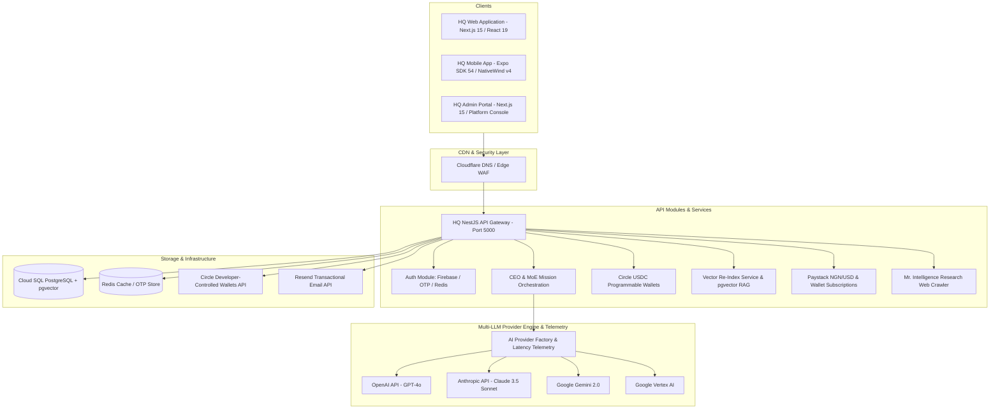

<div align="center">

# 🏛️ HQ — The Autonomous AI Operating System

### The World's First Enterprise AI OS for Autonomous Organization Orchestration

**A unified, multi-tenant operating system for AI C-Suite orchestration, real-time voice boardrooms, Circle USDC agentic wallets, multi-LLM intelligence, and organizational automation.**

[Website](https://hq.netify.ng) • [Admin Console](https://admin.netify.ng) • [Documentation](https://hq.netify.ng/docs) • [API Swagger Docs](https://api.hq.netify.ng/api/docs)

---

[](https://www.typescriptlang.org/)
[](https://nestjs.com/)
[](https://nextjs.org/)
[](https://expo.dev/)
[](https://www.circle.com/)
[](https://github.com/pgvector/pgvector)
[](https://www.prisma.io/)
[](https://cloud.google.com/)
[](LICENSE)

</div>

---

## 📋 Table of Contents

- [ Overview & Vision](#-overview--vision)
- [ Core Operating Principles](#-core-operating-principles)
- [ Complete AI Executive Roster](#-complete-ai-executive-roster)
- [ Mixture-of-Executives (MoE) Architecture](#-mixture-of-executives-moe-architecture)
- [ System & Network Architecture](#-system--network-architecture)
- [ Key Feature Modules](#-key-feature-modules)
  - [1. Circle USDC Programmable Agentic Wallets](#1-circle-usdc-programmable-agentic-wallets)
  - [2. Automated Vector RAG & pgvector Re-Indexing](#2-automated-vector-rag--pgvector-re-indexing)
  - [3. ASAD Voice Boardroom Engine](#3-asad-voice-boardroom-engine)
  - [4. Multi-LLM Telemetry & Provider Engine](#4-multi-llm-telemetry--provider-engine)
  - [5. Onboarding Engine & Free Tier Default Fallback](#5-onboarding-engine--free-tier-default-fallback)
  - [6. Executive Marketplace & Expansion Catalog](#6-executive-marketplace--expansion-catalog)
  - [7. Enterprise Multi-Tenancy & Security Vault](#7-enterprise-multi-tenancy--security-vault)
  - [8. Cross-Platform App Suite](#8-cross-platform-app-suite)
- [ Repository Structure](#-repository-structure)
- [ Database Schema & Domain Model](#-database-schema--domain-model)
- [ API Endpoint Reference](#-api-endpoint-reference)
- [ Developer Quick Start](#-developer-quick-start)
- [ Environment Variables Specification](#-environment-variables-specification)
- [ Cloud Build & GCP Deployment](#-cloud-build--gcp-deployment)
- [ Security & Governance](#-security--governance)
- [ License & Ownership](#-license--ownership)

---

## 🌟 Overview & Vision

**HQ** is a proprietary **AI Operating System** built by **Netify Ltd.** to replace fragmented corporate software stacks with an autonomous, self-orchestrating digital headquarters.

Modern companies spend millions managing disconnected tools for internal chat, documentation, project management, customer analytics, executive reports, and admin portals. **HQ** unifies these domains into a single intelligent platform where human executives collaborate directly with an autonomous roster of **AI C-Suite Executives**.

Led by **ASAD (Chief Executive Officer AI)**, HQ breaks complex organizational objectives down into structured sub-missions, delegates them to specialized department heads, verifies work quality via dedicated QA processes, executes autonomous financial payments via **Circle USDC Wallets**, and synthesizes institutional memory into actionable insights.

---

## ⚙️ Core Operating Principles

1. **Executive Autonomy**: AI agents hold formal domain roles, manage task queues, execute USDC transactions via Circle Programmable Wallets, and collaborate across departments.
2. **Human-in-the-Loop Governance**: Human leaders retain ultimate approval authority over high-impact decisions, billing allocations, and system permissions via biometric or OTP approvals.
3. **Strict Tenant Isolation**: Multi-tenant database design ensures that company data, knowledge assets, and conversations are isolated by `companyId`.
4. **Model Agnostic Routing**: The underlying AI provider factory automatically selects optimal models (OpenAI, Anthropic, Gemini, Vertex AI) based on task requirements, latency telemetry, and cost constraints.
5. **Zero-Trust Security**: One-time initial Super Admin setup prevents unauthorized admin registration post-deployment.

---

## 🤖 Complete AI Executive Roster

HQ ships with **5 default active executives** and an expandable catalog of **10+ marketplace executives**:

### 🛡️ Default Active Roster

| Executive | Title | Domain & Core Responsibilities |
| :--- | :--- | :--- |
| **ASAD** | **Chief Executive Officer (CEO)** | Central AI leader of HQ. Oversees strategic direction, scopes owner missions, orchestrates cross-department workflows, and guides users to marketplace upgrades. |
| **Teema** | **Operations Director (COO)** | Manages workflow execution velocity, monitors active task queues, optimizes resource allocation, and tracks mission execution timelines. |
| **Legal** | **Legal & Compliance Director** | Enforces regulatory compliance, conducts risk audits, supervises data retention policies, and enforces legal hold safeguards. |
| **Resource Director** | **Human Resources Director (CHRO)** | Manages personnel structures, team onboarding, organizational role alignment, and workforce productivity. |
| **Mr. Intelligence** | **Public Research Agent (CRO)** | Conducts deep web research on registered companies, industry domains, competitor analysis, and updates `OrgIntelligence` memory. |

### 🛒 Installable Marketplace Roster

| Executive | Title | Specialization |
| :--- | :--- | :--- |
| **Dr. Hiroshi Tanaka** | **Technology Director (CTO)** | Distributed cloud microservices, technical feasibility audits, system architecture, and GCP infrastructure. |
| **Linus Kovacs** | **Software Engineering Director** | Full-stack web & mobile code generation, git lifecycles, automated testing, and technical documentation. |
| **Dr. Sarah Ndiaye** | **AI & Machine Learning Director** | LLM prompt optimization, Vector RAG performance tuning, embedding models, and evaluation benchmarks. |
| **Sophia Sterling** | **Finance Director (CFO)** | Financial ledgers, corporate forecasting, budget allocation audits, and Circle USDC transactions. |
| **Jordan Belfort** | **Sales Director (CRO)** | Enterprise sales pipelines, lead generation strategies, contract closures, and revenue growth. |
| **Amara Okafor** | **Marketing Director (CMO)** | Viral digital marketing campaigns, target demographic acquisition, and brand positioning. |
| **Marcus Brody** | **Product Director (CPO)** | Product roadmaps, agile user story generation, backlog prioritization, and feature specs. |
| **Sienna Brooks** | **UX/UI Design Director** | Component design tokens, glassmorphic UI specs, accessibility standards, and visual brand guidelines. |
| **Rashid Al-Mansoori** | **Petroleum Industry Director** | Specialized energy sector intelligence, fuel logistics, oil & gas compliance, and supply chain tracking. |
| **Yuki Sato** | **Customer Success Director** | Customer churn mitigation, support ticket resolution velocity, and user onboarding flows. |

---

## 🧠 Mixture-of-Executives (MoE) Architecture

When a human leader submits an objective to HQ, the **Mixture-of-Executives (MoE)** engine processes the task through a 5-stage lifecycle:

```text
  [ Human Executive Directive ]
                │
                ▼
  [ 1. ASAD (CEO) Mission Decomposition ]
    ├── Scopes overall objective into sub-missions
    └── Assigns feasibility checks to department heads
                │
                ▼
  [ 2. Department Orchestration & Parallel Execution ]
    ├── Operations (Teema): Schedules task queue execution
    ├── Technology (Hiroshi/Linus): Generates code & technical specs
    ├── Research (Mr. Intelligence): Crawls public web data
    └── Finance (Sophia Sterling): Executes Circle USDC payment allocations
                │
                ▼
  [ 3. Quality Assurance (QA Executive Verification) ]
    ├── Evaluates output against safety guardrails & requirements
    └── Triggers revision loop if criteria are unmet
                │
                ▼
  [ 4. Automated pgvector Semantic Ingestion ]
    └── Re-indexes Markdown (.md) documents into pgvector vectorstore
                │
                ▼
  [ 5. Executive Briefing Synthesis ]
    └── Delivers unified executive report to Human Leader (Text + Audio)
```

---

## 🏗️ System & Network Architecture



---

## 🔑 Key Feature Modules

### 1. Circle USDC Programmable Agentic Wallets
- **Agentic Financial Autonomy**: Integrates `@circle-fin/developer-controlled-wallets` to provision virtual USDC wallets (`OrganizationWallet`) for organizations and AI Executives.
- **On-Chain Transactions**: Supports automated subscription payments, top-up credit purchases, and cross-department budget transfers in stablecoin USD.
- **Helper Utilities**: Ships with `apps/api/register-entity-secret.ts` and `apps/api/create-wallet.ts` for quick Circle API setup.

### 2. Automated Vector RAG & pgvector Re-Indexing
- **Semantic Markdown Chunking**: `VectorReindexService` automatically splits training documents by Markdown headers (`#`, `##`, `###`), generates vector embeddings, and updates `pgvector`.
- **3-Tier RAG Context Assembly**: RAG knowledge retrieval across Organization-wide `KnowledgeBase`, `DepartmentTrainingData`, and `ExecutiveTrainingData`.
- **CMS Re-Index Trigger**: Exposes `POST /cms/reindex-vectors` and a 1-click re-indexing trigger in the Admin Core Kernel.

### 3. ASAD Voice Boardroom Engine
- **Hands-Free Speech Interface**: Real-time voice interaction for boardroom briefings.
- **Audio Directive Dock**: Integrated into Web (`apps/web/src/components/voice/`), Admin (`apps/admin/src/components/voice/`), and Mobile (`mobile/components/voice/`).
- **ASAD Cadence**: Speech-to-Text and Text-to-Speech audio streaming with natural executive tone.

### 4. Multi-LLM Telemetry & Provider Engine
- **Dynamic Provider Switching**: Toggle between OpenAI, Anthropic, Gemini, Vertex AI, or local LLMs via unified `AIProvider` interfaces.
- **Streaming Latency Metrics**: Real-time provider performance benchmarks (ms latency per model) surfaced on the Admin Console Execution Log.

### 5. Onboarding Engine & Free Tier Default Fallback
- **11-Step Onboarding Wizard**: Automated workspace identity setup, real-time domain slug availability check, target market classification, and OTP email verification.
- **Default Free Tier**: Users who omit selecting a paid plan automatically default to the **Free Starter Tier ($0/mo)** with provisioned subscription limits (500 AI Monthly Credits & 10 Active Missions).
- **Tier Alignment**: Standardized pricing tiers across Web, Mobile, and API:
  - 🟢 **Free Starter Tier**: `$0 / mo`
  - ⚡ **Growth Scale Tier**: `$10 / mo`
  - 🏛️ **Enterprise OS Tier**: `$50 / mo`

### 6. Executive Marketplace & Expansion Catalog
- **1-Click Installs**: Expand organizational capabilities by installing individual executives or entire department suites.
- **Entitlement Enforcement**: Checks active plan tier (`FREE`, `PRO`, `ENTERPRISE`) before activating marketplace items.

### 7. Enterprise Multi-Tenancy & Security Vault
- **Row-Level Tenant Isolation**: All database queries enforce strict `companyId` scoping.
- **One-Time Super Admin Lock**: Automatically locks initial Super Admin registration once setup is complete (`http://localhost:3002/register`).

### 8. Cross-Platform App Suite
- **Web App (`apps/web`)**: Next.js 15, React 19, Tailwind CSS, Progressive Web App (PWA) with offline Service Worker support (`public/sw.js`).
- **Admin Portal (`apps/admin`)**: Platform console with Admin Command Palette (`apps/admin/src/components/admin-command-palette.tsx`), telemetry, and staff management.
- **Mobile App (`mobile`)**: Expo SDK 54, React Native, NativeWind v4, dark mode aesthetics, and biometric local authentication support.

---

## 📁 Repository Structure

```text
HQ/
├── apps/
│   ├── admin/                 # Netify Platform Administration Portal (Next.js 15)
│   │   ├── src/app/           # App Router pages (login, dashboard, cms, staff, white-label)
│   │   ├── src/components/    # Admin components (command palette, tenant inspection, voice button)
│   │   └── Dockerfile         # Standalone production container build
│   │
│   ├── api/                   # NestJS Core Backend Gateway
│   │   ├── src/modules/
│   │   │   ├── ai/            # Multi-LLM Provider Factory & Telemetry
│   │   │   ├── asset/         # Asset Storage & File Vector Management
│   │   │   ├── auth/          # Firebase, OTP, Setup Status, Super Admin Registration
│   │   │   ├── billing/       # Paystack, Wallet Payments, and Subscriptions
│   │   │   ├── cms/           # Training Data Content Management System
│   │   │   ├── company/       # Company Onboarding & Tier Provisioning
│   │   │   ├── executive/     # CEO, Operations, Legal, HR, Finance, VectorReindex Services
│   │   │   ├── intelligence/  # Web Research Crawler & OrgIntelligence Ingestion
│   │   │   ├── marketplace/   # Catalog Listings & Installation Engine
│   │   │   ├── mission/       # CEO Orchestrator, COS, MOE Execution Pipeline
│   │   │   └── wallet/        # Circle USDC Client & Wallet Controller
│   │   ├── create-wallet.ts   # Circle Developer Wallet Creation Script
│   │   ├── register-entity-secret.ts # Circle Entity Secret Script
│   │   └── Dockerfile         # NestJS production container build
│   │
│   ├── mobile/                # Expo SDK 54 Native Mobile App (React Native)
│   │   ├── app/               # Expo Router file-based navigation (tabs, modals)
│   │   ├── components/        # Mobile components (BillingHub, VoiceDock, ExecutiveCard)
│   │   └── tailwind.config.js # NativeWind v4 theme tokens
│   │
│   └── web/                   # Executive Tenant Web Workspace (Next.js 15 + PWA)
│       ├── public/            # PWA manifest.json and sw.js Service Worker
│       ├── src/app/           # Auth, Onboarding, CEO Chat, Missions, Marketplace, Settings
│       └── Dockerfile         # Web production container build
│
├── packages/
│   ├── ai-engine/             # Shared Multi-LLM Interfaces & RAG Helpers
│   ├── database/             # Prisma Schema, Migrations, Seeders, & Tools
│   ├── types/                # Shared TypeScript Interfaces & DTO Schemas
│   └── ui/                   # Shared React Component Library (@hq/ui)
│
├── cloudbuild-api.yaml        # GCP CloudBuild manifest for API Gateway
├── cloudbuild-web.yaml        # GCP CloudBuild manifest for Web Workspace
├── cloudbuild-admin.yaml      # GCP CloudBuild manifest for Admin Console
└── README.md
```

---

## 🗄️ Database Schema & Domain Model

HQ uses PostgreSQL with `pgvector` managed via Prisma ORM (`packages/database/prisma/schema.prisma`).

### Key Entities

```text
┌──────────────┐       1:N       ┌──────────────┐       1:N       ┌──────────────┐
│   Company    │ ───────────────> │     User     │ ───────────────> │  Department  │
└──────────────┘                 └──────────────┘                 └──────────────┘
       │                                │                                │
       │ 1:N                            │ 1:N                            │ 1:N
       ▼                                ▼                                ▼
┌──────────────┐                 ┌──────────────┐                 ┌──────────────┐
│ Subscription │                 │   Mission    │                 │  Executive   │
└──────────────┘                 └──────────────┘                 └──────────────┘
       │                                │ 1:N                            │
       │ 1:1                            ▼                                │ 1:N
       ▼                         ┌──────────────┐                        ▼
┌──────────────┐                 │     Task     │                 ┌──────────────┐
│  OrgWallet   │                 └──────────────┘                 │ Conversation │
└──────────────┘                                                  └──────────────┘
```

* **Company**: Tenant root containing name, slug, level (`FREE`, `PRO`, `ENTERPRISE`), and subscription details.
* **OrganizationWallet**: Virtual USD balance & Circle USDC wallet mapping for autonomous agent transactions.
* **User**: Platform account linked with Firebase UID, email, role (`SUPER_ADMINISTRATOR`, `ADMINISTRATOR`, `EXECUTIVE_USER`, `MEMBER`), and company ID.
* **Executive**: AI Agent profile containing name, title, `roleKey`, system prompt, biography, and active workspace status.
* **Mission**: High-level objective assigned to the company, tracked by status (`SCOPING`, `EXECUTING`, `COMPLETED`, `PAUSED`).
* **Task**: Sub-task created by CEO Orchestrator for specific executives.

---

## 🌐 API Endpoint Reference

The API runs on `http://localhost:5000` (or `https://api.hq.netify.ng`). Full Interactive Swagger UI available at `/api/docs`.

### Authentication (`/auth`)
- `GET  /auth/setup-status` — Check if initial Super Admin registration is required.
- `POST /auth/register-super-admin` — Register initial Super Administrator.
- `POST /auth/send-otp` — Send 6-digit OTP verification email via Resend.
- `POST /auth/verify-otp` — Verify OTP code and mark email as verified.
- `GET  /auth/me` — Fetch authenticated user profile, permissions, and organization context.

### Executive & CMS Vector Re-Indexing (`/executive` & `/cms`)
- `POST /cms/reindex-vectors` — Trigger background semantic re-indexing of Markdown files into pgvector.
- `POST /mission/execute` — Dispatch Mixture-of-Executives execution pipeline.
- `GET  /executive/roster` — Fetch active AI Executive roster.

### Circle Wallets & Billing (`/wallet` & `/billing`)
- `GET  /wallet/balance` — Fetch Organization Virtual Wallet & Circle USDC balance.
- `POST /billing/checkout` — Initiate Paystack Checkout session.
- `POST /billing/wallet-pay` — Pay for subscription upgrade directly using Virtual Wallet balance.

---

## 🚀 Developer Quick Start

### Prerequisites
- **Node.js**: `v22.0.0+`
- **Yarn**: `v1.22+`
- **PostgreSQL**: `v16.0+` (with `pgvector` extension)
- **Redis**: `v7.0+`

### Step 1: Clone Repository
```bash
git clone https://github.com/Marinijibia/HQ.git
cd HQ
```

### Step 2: Install Dependencies
```bash
yarn install
```

### Step 3: Configure Environment
Copy environment template:
```bash
cp .env.example .env
```

### Step 4: Setup Database & Seed Data
```bash
# Generate Prisma Client
yarn workspace @hq/database prisma generate

# Run Database Migrations
yarn workspace @hq/database prisma migrate dev --name init

# Seed Default Executives & Marketplace Data
yarn workspace @hq/database seed
```

### Step 5: Start Development Servers
```bash
yarn dev
```

App Access Points:
- 🏢 **HQ Web Workspace**: `http://localhost:3000`
- 🛡️ **HQ Admin Portal**: `http://localhost:3002`
- ⚡ **HQ API Gateway**: `http://localhost:5000`
- 📖 **Swagger OpenAPI Specs**: `http://localhost:5000/api/docs`

---

## ☁️ Cloud Build & GCP Deployment

HQ ships with production-ready Google CloudBuild manifests for automated container deployment to **Google Cloud Run**:

* `cloudbuild-api.yaml`: Builds and deploys `hq-api` container to Cloud Run.
* `cloudbuild-web.yaml`: Builds and deploys `hq-web` container to Cloud Run.
* `cloudbuild-admin.yaml`: Builds and deploys `hq-admin` container to Cloud Run.

To manually trigger a Cloud Build run:
```bash
gcloud builds submit --config=cloudbuild-api.yaml
```

---

## 🔒 Security & Governance

- **Responsible Disclosure**: To report security vulnerabilities, email **[security@netify.ng](mailto:security@netify.ng)**.
- **Security Audit**: All API endpoints require Bearer Token authorization with validated custom claims.

---

## 📄 License & Ownership

Copyright © 2026 **Netify Ltd.** All Rights Reserved.

This software is proprietary and confidential. Unauthorized copying, modification, or distribution is strictly prohibited without written authorization from Netify Ltd.

<div align="center">

---
### 🏛️ **HQ** • Built with ❤️ by **Netify Ltd.**

</div>
