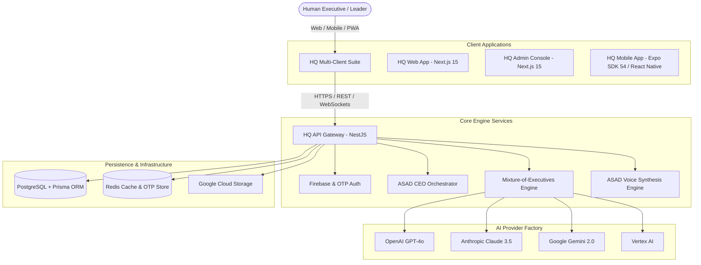

<div align="center">

# 🏛️ HQ
### The World's First AI Operating System for Autonomous Organizations

**One intelligent unified OS for AI executive orchestration, multi-department collaboration, real-time voice boardrooms, and enterprise governance.**

[Website](https://hq.netify.ng) • [Admin Console](https://admin.netify.ng) • [Documentation](https://hq.netify.ng/docs) • [API Specs](https://api.hq.netify.ng/api/docs)

---

[](https://www.typescriptlang.org/)
[](https://nestjs.com/)
[](https://nextjs.org/)
[](https://expo.dev/)
[](https://www.prisma.io/)
[](https://www.postgresql.org/)
[](https://www.docker.com/)
[](https://cloud.google.com/)
[](LICENSE)

</div>

---

## 🌟 Executive Overview

**HQ** is a state-of-the-art **AI Operating System** designed to replace fragmented corporate software stacks with a single, self-orchestrating digital headquarters. 

Rather than toggling between disconnected chat applications, documentation silos, project managers, and analytics portals, **HQ** introduces an autonomous roster of **AI Executives** led by **ASAD (Chief Executive Officer)**. Human leaders collaborate directly with specialized AI C-suite executives who plan, execute, code, audit, and research in real-time across Web, Mobile, and Admin interfaces.

---

## 🔥 Key Breakthrough Features

### 👑 1. Autonomous AI Executive Roster
* **ASAD (CEO)**: Central AI leader overseeing strategic mission scoping, cross-department orchestration, and feasibility verification.
* **Teema (Operations Director)**: Task queue optimization, workflow velocity, and execution pipeline tracking.
* **Legal & Compliance Director**: Regulatory compliance, automated risk audits, data retention safeguards, and legal hold checks.
* **Resource Director (HR)**: Talent management, org structure alignment, and team onboarding.
* **Mr. Intelligence (Web Research Agent)**: Real-time public web research, business domain intelligence crawling, and organizational memory updates.
* **Marketplace Executives**: CTOS, CFOs, Sales Directors, AI/ML Engineers, and UI/UX Directors installable on-demand.

### 🎙️ 2. ASAD Voice Boardroom Engine
* Real-time hands-free voice synthesis and voice command interface for executive boardroom briefings.
* Direct voice directive dock available across Web, Admin, and Expo Mobile apps.

### ⚡ 3. Multi-LLM Provider Engine
* Pluggable AI provider factory supporting **OpenAI (GPT-4o)**, **Anthropic (Claude 3.5 Sonnet)**, **Google Gemini 2.0**, **Vertex AI**, and custom **HQ Local Engines**.
* Automatic fallback routing and evaluation metrics.

### 🛒 4. Executive Marketplace & Expansion Packs
* Install additional AI department packs (Technology, Finance, Sales & Growth, Energy, Customer Success) with 1-click workspace deployment.

### 🔒 5. Enterprise Security & One-Time Super Admin Provisioning
* Built-in setup protection preventing unauthorized admin registration once initial Super Admin is initialized.
* Firebase Auth, Resend OTP email verification, RBAC permissions, and encrypted environment vaults.

### 📱 6. Cross-Platform Everywhere (Web, Mobile, PWA, Admin)
* Next.js 15 Web Workspace with Progressive Web App (PWA) support.
* Expo SDK 54 Mobile Application with NativeWind v4 styling & dark theme.
* Netify Platform Administration Console for tenant telemetry and management.

---

## 🏗️ System Architecture



---

## 📁 Repository Structure

```text
HQ/
├── apps/
│   ├── admin/             # Netify Platform Administration Portal (Next.js 15)
│   ├── api/               # NestJS Core Backend Gateway & Executive AI Services
│   ├── mobile/            # Expo SDK 54 Native Mobile Application (React Native)
│   └── web/               # Executive Workspace & Boardroom (Next.js 15 + PWA)
│
├── packages/
│   ├── ai-engine/         # Shared Multi-LLM Provider Interfaces & RAG Utilities
│   ├── analytics/        # Telemetry & Performance Event Trackers
│   ├── database/         # Prisma Schema, Migrations, and Seed Scripts
│   ├── design-system/    # Shared Design Tokens & Theme Specs
│   ├── executives/       # Executive Prompts & Role Configurations
│   ├── prompts/          # Master AI System Prompts & Guardrails
│   ├── sdk/              # Type-Safe API Client SDK
│   ├── types/            # Shared TypeScript Interfaces & DTO Schemas
│   ├── ui/               # Shared React Component Primitives
│   └── utils/            # Shared Formatters & Validators
│
├── infrastructure/        # Dockerfiles & GCP Cloud Run Deployment Manifests
├── docs/                 # Platform Specs, System Guides, and Architecture Specs
└── README.md
```

---

## 🚀 Quick Start Guide

### Prerequisites
* **Node.js**: `v22.0.0` or higher
* **Yarn**: `v1.22+` or **pnpm**
* **Docker & PostgreSQL**: `v16.0+`
* **Expo Go App**: Version 54 compatible for mobile testing

### 1. Clone the Repository
```bash
git clone https://github.com/Marinijibia/HQ.git
cd HQ
```

### 2. Install Dependencies
```bash
yarn install
```

### 3. Environment Setup
Copy the environment template and configure database credentials:
```bash
cp .env.example .env
```

### 4. Database Setup & Seeding
Run Prisma migrations and seed the database with the default AI Executive roster:
```bash
# Generate Prisma Client
yarn workspace @hq/database prisma generate

# Run Database Migrations
yarn workspace @hq/database prisma migrate dev --name init

# Seed Default Company & AI Roster
yarn workspace @hq/database seed
```

### 5. Launch Development Servers
Start all applications concurrently via Turborepo:
```bash
yarn dev
```

The apps will be accessible at:
* 🌐 **HQ Web Workspace**: `http://localhost:3000`
* 🛡️ **HQ Admin Console**: `http://localhost:3002`
* ⚡ **HQ API Server**: `http://localhost:5000`
* 📖 **API Swagger Docs**: `http://localhost:5000/api/docs`

### 📱 Launching Mobile App (Expo SDK 54)
```bash
cd mobile
npx expo start --clear
```
Scan the generated QR code using **Expo Go** on iOS or Android.

---

## 🔒 One-Time Super Admin Provisioning

HQ features built-in security for initial deployment setup:

1. On first installation, visit `http://localhost:3002/register` (or `https://admin.netify.ng/register`).
2. Register the initial **Super Administrator** root account.
3. Once created, public registration is **automatically locked** to prevent unauthorized access. Future staff members must be invited by an active Super Admin.

---

## 🐳 Docker Deployment

HQ includes production-ready Docker builds for containerized cloud environments:

```bash
# Build API Service
docker build -t hq-api -f apps/api/Dockerfile .

# Build Web Application
docker build -t hq-web -f apps/web/Dockerfile .

# Build Admin Portal
docker build -t hq-admin -f apps/admin/Dockerfile .
```

---

## 🛣️ Product Roadmap

- [x] **Phase 1 — Core Architecture**: Monorepo structure, NestJS API gateway, PostgreSQL schema, Prisma ORM.
- [x] **Phase 2 — AI Executive Roster**: ASAD CEO orchestrator, Teema Operations, Legal, HR, and Mr. Intelligence.
- [x] **Phase 3 — ASAD Voice Engine**: Hands-free voice boardroom modal & real-time audio synthesis.
- [x] **Phase 4 — Multi-LLM Factory**: Pluggable support for OpenAI, Anthropic, Gemini, Vertex AI, and local models.
- [x] **Phase 5 — Cross-Platform Suite**: Next.js 15 Web App, Expo SDK 54 Mobile App, and Netify Admin Portal.
- [x] **Phase 6 — One-Time Setup Vault**: Initial Super Admin setup lock & Resend OTP email verification.
- [ ] **Phase 7 — Autonomous Workflow Execution**: Self-triggering scheduled executive missions & webhooks.

---

## 📄 License & Ownership

Copyright © 2026 **Netify Ltd.** All Rights Reserved.

This repository and its codebase are proprietary and confidential. Unauthorized copying, modification, or distribution is strictly prohibited without explicit written consent from **Netify Ltd.**

<div align="center">

---
### 🏛️ **HQ** • Designed & Developed by **Netify Ltd.**

</div>
